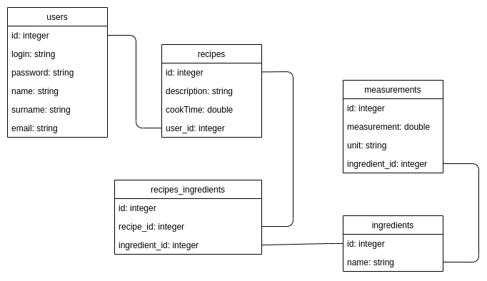

# projekt-zaliczeniowy-ar-js

Implementation of an internet application with kitchen recipes, created for the subject of Internet Engineering.

Projekt-zaliczeniowy-ar-js created by GitHub Classroom.

## Applied technologies and libraries:
- Node.js -> https://nodejs.org/en/
- npm -> https://www.npmjs.com
- knex -> http://knexjs.org https://www.npmjs.com/package/knex
- objection -> https://www.npmjs.com/package/objection
- sqlite3 -> https://www.sqlite.org/index.html
- cross-env -> https://www.npmjs.com/package/cross-env
- bcryptjs -> https://www.npmjs.com/package/bcryptjs
- body-parser -> https://www.npmjs.com/package/body-parser
- jsonwebtoken -> https://www.npmjs.com/package/jsonwebtoken

##Database schema

We have created a database based on the schema:

We used migrations to control changes to the database structure.

##Project description - what we did

In javascript, we have created models corresponding to individual tables in the database. In the models, we defined the relationships between the models.

Then we established routing. There are HTTP methods in routing:
- GET - used to request data from a specified resource.
- POST - used to send data to a server to create a resource.
- PUT - used to send data to a server to update a resource.
- DELETE - method deletes the specified resource.

Established endpoints allowed us to download, add, modify and delete individual, selected data from the database.

We have handled bugs related to:
- database,
- when the command is not sent correctly,
- with code 404 file not found.

We handled exceptions:
- user not found,
- login or email is taken,
- recipe not found,
- ingredient not found,
- measurement not found.

Implemented functionalities:
- user registration,
- user login,
- downloading user data,
- updating user data,
- removing a user,
- download of data on all provisions,
- downloading data about a specific recipe,
- adding a new recipe,
- updating an existing rule,
- removing a specific provision,
- download data on all ingredients,
- downloading data about a specific ingredient,
- adding a new ingredient,
- update of an existing component,
- removal of a specific component,
- download data on all measurements,
- downloading data about specific measurements,
- adding new measurements,
- update of existing measurements,
- removal of specific measurements.
  
